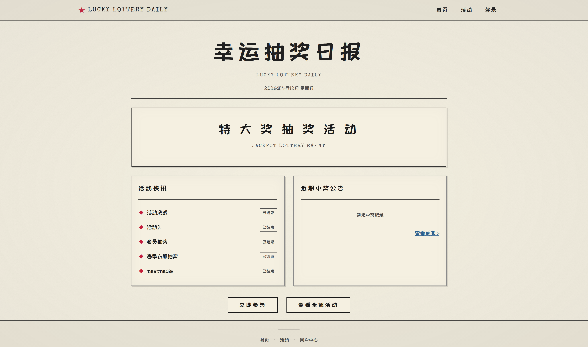
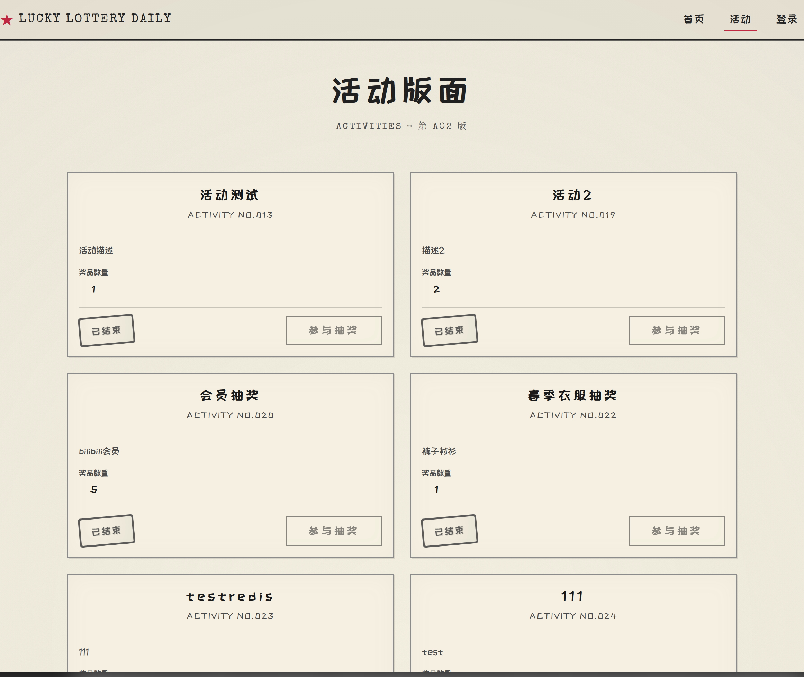
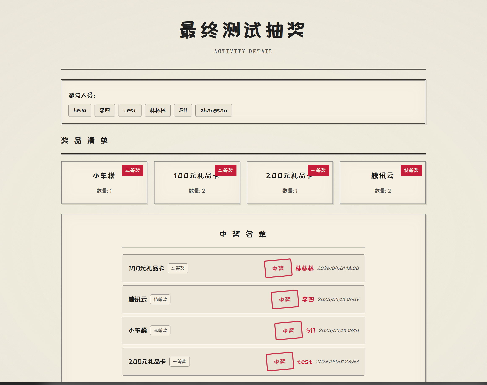
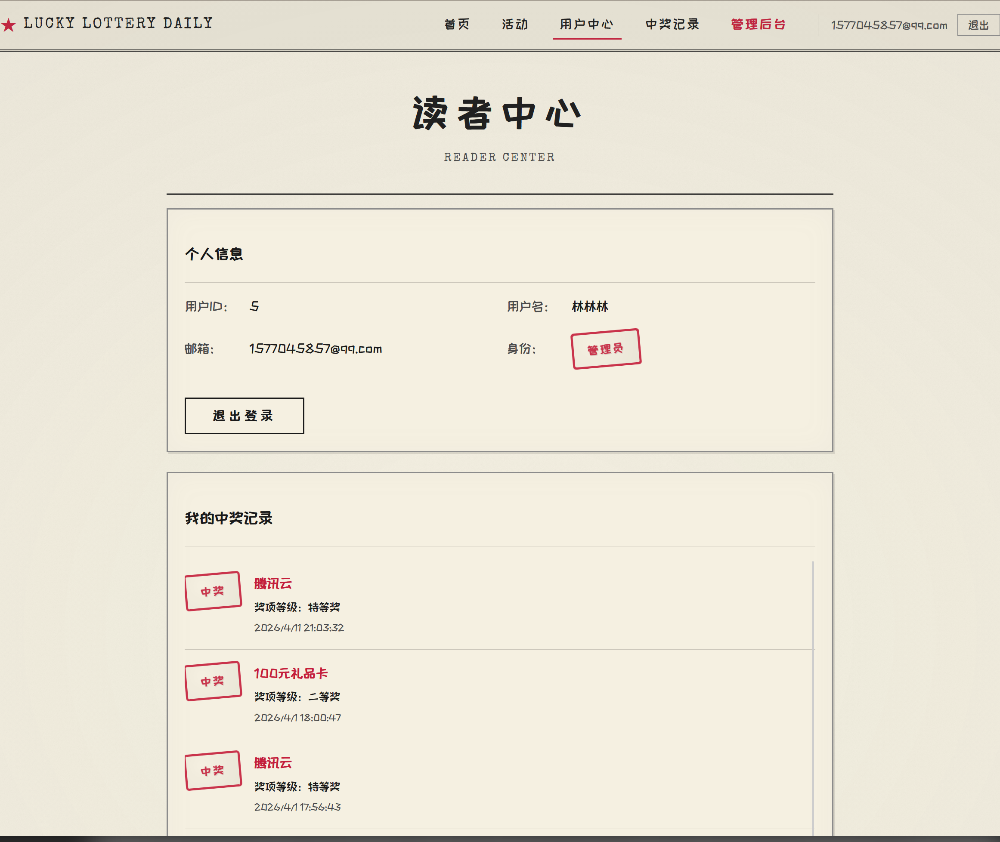
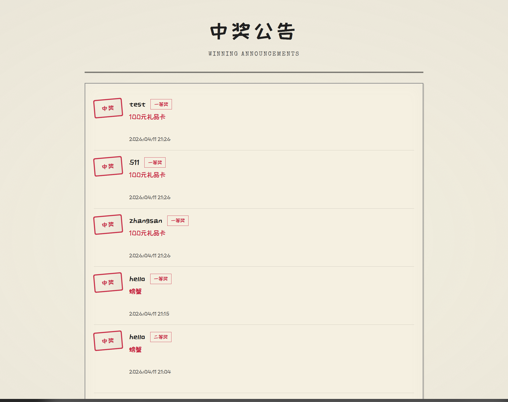
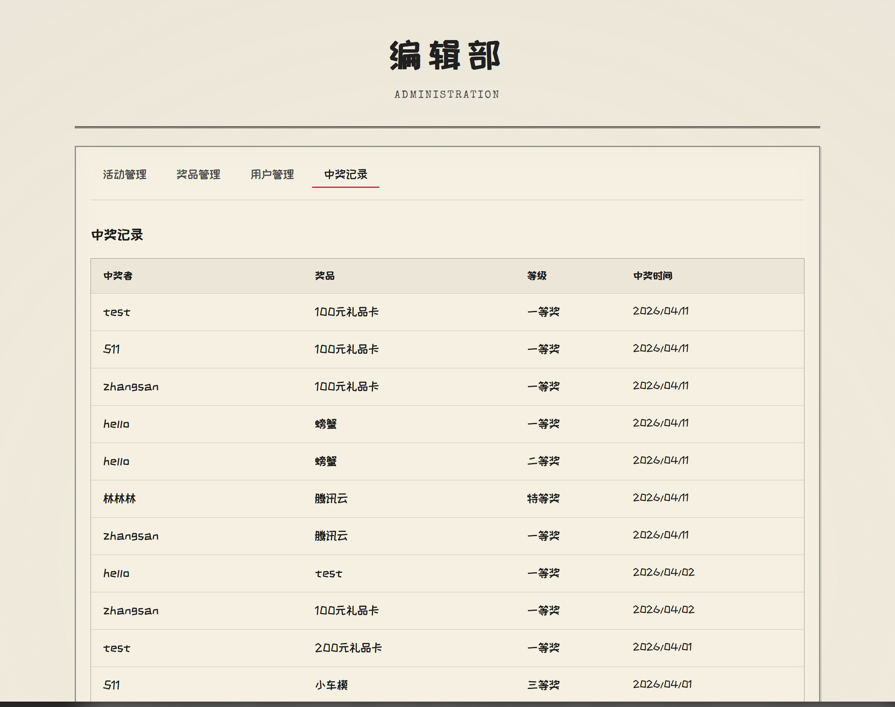

# Lottery System - 幸运抽奖日报

<p align="center">
  
  
  
  
</p>

一个基于 **Spring Boot + Vue 3** 的抽奖系统，采用独特的新闻纸复古风格设计（泛黄纸张、手写字体、邮戳印章），为用户提供沉浸式的抽奖体验。

## ✨ 功能特性

- **活动管理** - 创建、查看和管理抽奖活动
- **随机抽奖** - 基于前端随机算法的公平抽奖机制
- **中奖公告** - 实时展示中奖名单，活动结束后公布结果
- **用户中心** - 查看个人信息和中奖记录
- **管理后台** - 完整的活动、奖品、用户和中奖记录管理
- **邮件通知** - 支持邮箱验证码注册和登录

## 📸 界面预览

### 首页 - 幸运抽奖日报
<p align="center">
  
</p>

### 活动版面
<p align="center">
  
</p>

### 活动详情 & 抽奖
<p align="center">
  
</p>

### 读者中心（用户中心）
<p align="center">
  
</p>

### 中奖公告
<p align="center">
  
</p>

### 编辑部（管理后台）
<p align="center">
  
</p>

## 🛠️ 技术栈

<p align="center">
  
  
  
  
  
  
</p>

<p align="center">
  
  
  
  
</p>

## 📋 环境要求

- JDK 17+
- Node.js 18+
- MySQL 8.0+
- Redis 6.0+
- RabbitMQ 3.8+

## 🚀 快速开始

### 1. 克隆项目
```bash
git clone https://github.com/Jul1en-Lin/Lottery-system.git
cd Lottery-system
```

### 2. 配置环境
编辑配置文件：
- `src/main/resources/application-dev.yml` - 开发环境
- `src/main/resources/application-prod.yml` - 生产环境

配置数据库、Redis、RabbitMQ 连接信息。

### 3. 启动后端
```bash
# 开发运行（热启动）
./mvnw spring-boot:run -Dspring-boot.run.profiles=dev

# 或构建并运行
./mvnw clean package
java -jar target/lottery-system-0.0.1-SNAPSHOT.jar --spring.profiles.active=dev
```

### 4. 启动前端
```bash
cd lottery-frontend
npm install
npm run dev
```

访问 http://localhost:3000

## 📁 项目结构

```
Lottery-system/
├── src/main/java/com/julien/lotterysystem/  # 后端源码
│   ├── common/                              # 公共组件
│   ├── controller/                          # 控制器层
│   ├── service/                             # 服务层
│   ├── mapper/                              # 数据访问层
│   └── entity/                              # 实体类
├── src/main/resources/
│   ├── static/                              # 前端构建输出
│   ├── application-dev.yml                  # 开发配置
│   └── application-prod.yml                 # 生产配置
├── lottery-frontend/                        # 前端源码
│   ├── src/
│   │   ├── api/                             # API 接口
│   │   ├── components/                      # 组件
│   │   ├── views/                           # 页面视图
│   │   ├── stores/                          # Pinia 状态管理
│   │   └── styles/                          # SCSS 样式
│   └── vite.config.js                       # Vite 配置
└── docs/                                    # 项目文档
```

## 📝 配置说明

| 配置项 | 说明 | 默认值 |
|--------|------|--------|
| `spring.profiles.active` | 运行环境 | `prod` |
| `PICTURE_DEST_PATH` | 图片存储路径 | `${user.dir}/picture/` |

## 🤝 贡献指南

1. Fork 本仓库
2. 创建特性分支 (`git checkout -b feature/AmazingFeature`)
3. 提交更改 (`git commit -m 'Add some AmazingFeature'`)
4. 推送到分支 (`git push origin feature/AmazingFeature`)
5. 创建 Pull Request

## 📄 许可证

本项目基于 [MIT](LICENSE) 许可证开源。

---

<p align="center">
  Made with ❤️ by Jul1en-Lin
</p>
